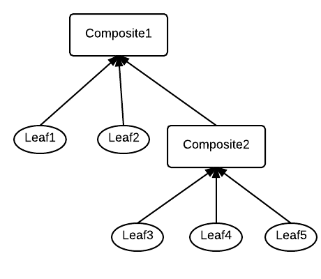

#Composite

##Définition :

<blockquote>
    <strong>The composite pattern</strong> allows you to compose objects into tree structures to represent part-whole hierarchies.
    Composite lets clients treat individual obects and composition of objects uniformly.
</blockquote>

Modéliser une structure arborescente (hiérarchique) dans laquelle chaque composant (Component ou noeud), implémente un (ou plusieurs) comportement(s) commun(s). En d'autres termes, l'ensemble peut être manipulé par le client de la même manière qu'une sous-partie ou chacun de ses objets individuellement.

On distingue les *branches* (ou *objets composites*) et les *feuilles*. Chaque noeud, qu'il soit branche ou feuille se nomme un composant (*component*).

##Exemples :

Un système de fichiers :

* les répertoires représentent des branches (ou "composites")
* les fichiers représentent des feuilles
* Quel que soit le composant (répertoire ou fichier), il est possible de le renommer, le supprimer, le déplacer, etc.

Autres exemples : les bibliothèques de composants graphiques Java (Swing) qui définissent des conteneurs pouvant accueillir d'autres conteneurs (Frames, Panels, etc.), les formulaires et sous-formulaires de Symfony, la réprésentation d'un organigramme d'entreprise, les traitements de texte (sections, paragraphes, textes, etc.), un gestionnaire de tâches et sous-tâches, etc.

##Diagramme du composite :

##Exemple d'implémentation (PHP) :

Voir l'exemple : [composite.php](examples/composite.php)

Cet exemple implémente (dans les grandes lignes !) les différents services (*Department*) constituant une entreprise et les différentes
compétences qu'ils exposent (langages de programmation, technologies, etc.).

Il modélise donc des services (class *Department*) et des employés (class *Employee*) sous forme de structure arborescente.

* Les services peuvent être constitués de sous-services : ils correspondent donc à un élément de type "Composite" (ou branche)
* Les employés représentent les feuilles
* Les services et les employés étant des noeuds, ils agissent comme un type "Component"
* Les services et les employés exposent des compétences :
    - les employés possèdent des compétences individuelles
    - les compétences d'un service sont la synthèse des compétences des services qui le composent et/ou de ses employés
* L'exposition des compétences représente donc l'interface commune à tous les composants

Il s'appuie sur deux interfaces :

* L'interface *Skillable* implémentée par tous les composants/noeuds de la structure (service ou employé) ; c'est le dénominateur commun de tous les noeuds ;
* L'interface *SkillableComposite* implémentée uniquement par les élements composites, à savoir les services (et donc pas par les feuilles, c'est-à-dire les employés) ; elle expose les méthodes de gestion des enfants qui constituent l'élément composite (add, remove, etc.) ;

## Exemple de l'interface de Symfony `FormInterface`

Composant 'Form' de Symfony : [l'interface FormInterface](https://github.com/symfony/form/blob/master/FormInterface.php)
