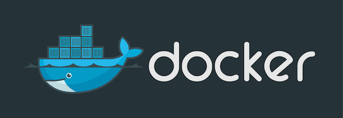

# Docker



* [Installation sur Ubuntu 14.04 (LTS)](#installation)
* [Les images Docker](#images)
* [Les containers](#containers)
* [Les volumes](#volumes)
* [Docker Compose](#compose)
* [Exemple](#exemple)
* [Sur la toile](#links)

## Références :

* Site officiel : [https://www.docker.com/](https://www.docker.com/)
* Documentation : [https://docs.docker.com/](https://docs.docker.com/)
* Dépôts (images) : [Docker Hub](https://hub.docker.com/)
* Images officielles : [https://github.com/docker-library/docs](https://github.com/docker-library/docs)

## <a name="installation"></a>Installation sur Ubuntu 14.04 (LTS)

Réf.: [https://docs.docker.com/engine/installation/ubuntulinux/](https://docs.docker.com/engine/installation/ubuntulinux/)

```shell
## Ajouter une nouvelle clé GPG :
$ sudo apt-key adv --keyserver hkp://p80.pool.sks-keyservers.net:80 --recv-keys 58118E89F3A912897C070ADBF76221572C52609D

$ sudo touch /etc/apt/sources.list.d/docker.list
$ sudo echo "deb https://apt.dockerproject.org/repo ubuntu-trusty main" >> /etc/apt/sources.list.d/docker.list

$ sudo apt-get update
## Purger l'ancien dépôt :
$ sudo apt-get purge lxc-docker
## Conseillé : ajouter linux-image-extra (pour pouvoir utiliser le syst. AUFS) :
$ sudo apt-get install linux-image-extra-$(uname -r)
$ sudo apt-get install docker-engine
```

## <a name="images">Les images Docker

```shell
## Rechercher une image (Réf. : https://hub.docker.com/) :
$ docker search mongodb

## Liste des images téléchargées :
$ docker images

## Télécharger une image :
$ docker pull tutum/mongodb

## Supprimer une image (`docker rmi`) :
$ docker rmi hello-world
```

### Créer une image personnalisée

Réf.: https://docs.docker.com/engine/tutorials/dockerimages/

@todo: à compléter

## <a name="containers">Les containers

### Liste des containers

```shell
## Liste des containers en cours d'exécution :
$ docker ps
## Liste des containers (y compris arrêtés) :
$ docker ps --all
```

### Démarrer un container (`docker run`)

Réf: https://docs.docker.com/engine/reference/run/

```shell
## Démarrer un container en console interactive :
$ docker run -t -i ubuntu:latest /bin/bash

## Démarrer un container en mode détaché (démon) :
$ docker run -d --name redis redis:latest  --bind 127.0.0.1
## Démarrer une console CLI connectée à un serveur :
$ docker run --rm -it --net container:redis --name redis-cli redis-cli -h 127.0.0.1

## Arrêter un container (cf. `docker ps` pour obtenir l'identifiant du container) :
$ docker stop container_id

## Démarrer une version donnée d'un container (`image[:tag]`) :
$ docker run ubuntu:14.04
$ docker run postgres:9.5

## Liste des options de la commande `run`:
$ docker run --help
```

### Fixer une variable d'environnement (`-e, --env, --env-file`)

```shell
## $MYVAR1 dans le conteneur aura pour valeur $MYVAR1 de l'hôte
$ docker run -e MYVAR1 --env MYVAR2=foo --env-file ./env.list ubuntu bash
```

### Status container (`docker inspect`)

Réf.: https://docs.docker.com/engine/reference/commandline/inspect/

Affiche les informations sur le container: status, adresse IP, mapping des ports, etc.

```shell
$ docker inspect <container_id>
## ou bien
$ docker inspect <container_name>
```

### Publication et exposition des ports (`-p, --expose`)

```shell
## Lie le port 8080 du conteneur sur le port 80 de l'hôte:
$ docker run -p 127.0.0.1:80:8080 ubuntu bash

## Expose le port 80 du conteneur sans publier le port sur l'interface syst. de l'hôte:
$ docker run --expose 80 ubuntu bash
```

## <a name="volumes">Les volumes

### Créer un container de volume

```shell
$ docker create -v /dbdata --name dbstore ubuntu /bin/bash
```

### Lier un container de volume à un container exécutable (`--volumes-from`)

Source: https://www.digitalocean.com/community/tutorials/how-to-work-with-docker-data-volumes-on-ubuntu-14-04

```shell
## Créer le conteneur de volume :
$ docker create -v /tmp --name datacontainer ubuntu
## Lancer un conteneur Ubuntu et lui attacher le conteneur de volume ci-dessus.
## Toute écriture dans le répertoire /tmp du conteneur Ubuntu sera sauvegardé
## dans dans le répertoire /tmp du conteneur de volume :
$ docker run -t -i --volumes-from datacontainer ubuntu /bin/bash
$ echo "Hello !!!" > /tmp/hello
```

### Lier un volume du host à un container (`run -v|--volume`)

```shell
## Le répertoire /src/webapp de l'hôte est monté sur le répertoire /webapp du container:
$ docker run -d -P --name web -v /src/webapp:/webapp training/webapp python app.py
```

## <a name="compose">Docker Compose

Réf.: https://docs.docker.com/compose/overview/

@todo: à compléter

## <a name="exemple">Exemple (PostgreSQL)

```shell
## Image officielle de PostgreSQL (https://hub.docker.com/_/postgres/):
$ docker pull postgres

## Démarrer le serveur Postgres 9.6 :
$ docker run --name postgres -e POSTGRES_PASSWORD=postgres -d postgres:9.6

## Se connecter depuis une console psql :
$ docker run -it --rm --link postgres:pg postgres psql -h postgres -U postgres
```

## <a name="links">Sur la toile

* [Docker pas à pas sur une application Symfony2](https://blog.webnet.fr/docker-pas-a-pas-sur-une-application-symfony2-part1/) (mars 2016)
* [Tutoriel Symfony et Docker grâce à docker-compose ](https://www.baptiste-donaux.fr/tutoriel-docker-symfony-docker-compose/)(sept. 2015)
* [Faire tourner une application Symfony avec Docker et docker-compose ](https://vincent.composieux.fr/article/faire-tourner-une-application-symfony-avec-docker-et-docker-compose)(avril 2015)

[Dernière mise à jour : octobre 2016]

[Version de référence : Docker 1.12.*]
