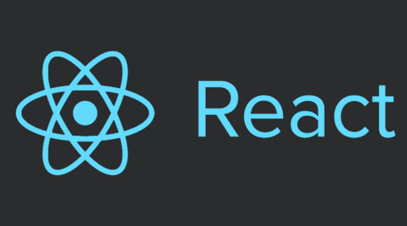

# React.js

* [Ressources](#resources)

##  Ressources

* [Site officiel](https://facebook.github.io/react/)
* [Documentation officielle](https://facebook.github.io/react/docs/hello-world.html)
* [Tutoriel d'introduction à React](https://facebook.github.io/react/tutorial/tutorial.html)
* [Awesome React](https://github.com/enaqx/awesome-react#flux-general-resources) : page recensant de nombreuses ressources sur React
* [Create React App](https://github.com/facebookincubator/create-react-app#getting-started) : créer un squelette d'application React (Webpack, Babel, ESLint, etc.)
* [React App SDK](https://github.com/kriasoft/react-app) : commandes & templates pour générer une application React
* [redux-minimal](https://redux-minimal.js.org/) React/Redux minimal starter kit (React, Redux, Webpack, webpack-dev-server, Babel, Bootstrap3, etc.)

