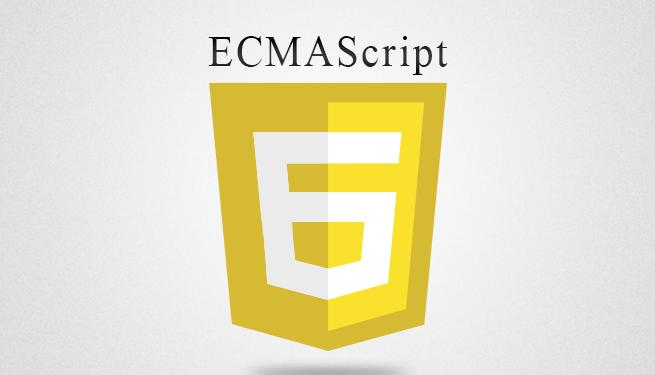

# Javascript, ECMAScript 2015, ES6

* [Les Promesses](#promises)
* [Itérateurs & générateurs](#iterators)

## Les Promesses en JS

@todo: à compléter

### Resources

* [Mozilla Developer Network (MDN)](https://developer.mozilla.org/fr/docs/Web/JavaScript/Reference/Objets_globaux/Promise)

## Itérateurs & générateurs

@todo: à compléter

### Resources

* [Mozilla Developer Network (MDN)](https://developer.mozilla.org/fr/docs/Web/JavaScript/Guide/iterateurs_et_generateurs)
