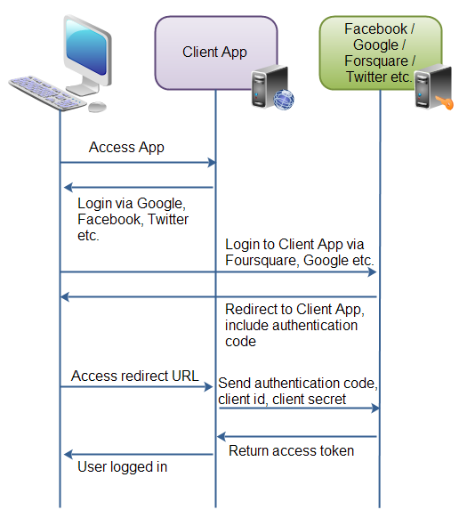

# Protocole d'autorisation Oauth2

Spécifications : https://tools.ietf.org/html/draft-ietf-oauth-v2-23

Référence : [Tutoriel Oauth2 (Jenkov.com)](http://tutorials.jenkov.com/oauth2/index.html)

* [Vue d'ensemble](#overview)
* [Participants](#roles)
* [Types et profils de clients](#client-types)
* [Les autorisations](#authorization)
* [Les points d'entrée (endpoints)](#endpoints)
* [Requêtes et réponses](#request-response)

## <a name="overview"></a> Vue d'ensemble

Exemple de workflow d'autorisation Oauth2 le plus courant :



* L'utilisateur se rend sur l'application web cliente qui affiche un bouton "_Login via Facebook_" (ou Google, ou Twitter, etc.)
* Lorsque l'utilisateur clique sur le bouton, il est redirigé vers l'application d'authentification (Facebook). L'utilisateur se logue et Facebook lui demande s'il souhaite autoriser l'application cliente à accéder à ses données FB. L'utilisateur accepte
* Facebook redirige l'utilisateur vers une URI que l'app cliente avait fournie (en général, cette URI est fournie lorsque l'application cliente s'enregistre auprès de l'application d'authentification ; c'est également à ce moment que l'application d'authentification fournit à l'application cliente un __client id__ et un __client password__). L'URI de redirection est complétée par un __code d'authentification__. 
* L'utilisateur retourne via l'URI de redirection vers l'application cliente. En tâche de fond, l'application cliente contacte l'application d'authentification (en passant son id client, son mot de passe et le code d'authentification reçu), en échange de quoi l'application d'authentification retourne un __access token__
* L'application cliente peut désormais utiliser cet _access token_ pour accéder aux ressources de l'application d'authentification relatives à l'utilisateur courant

## <a name="roles"></a> Participants (__roles__)


### Le propriétaire de la ressource (_Resource owner_)

C'est la personne (ou l'application) qui possède les informations à partager. Ex: un utilisateur Facebook ou Google.

### Le serveur de ressources (_Resource server_)

C'est le serveur qui héberge les ressources (ex: Google, Facebook)

### L'application cliente (_Client app_)

C'est l'application qui sollicite un accès aux ressources sur le serveur de ressources. Ex: un jeu vidéo qui souhaite accéder au profil Facebook d'un utilisateur.

### Le serveur d'autorisation (_Authorization server_)

C'est l'application qui autorise l'application cliente à accéder aux ressources et aux informations de l'utilisateur (_resource owner_). Un seul serveur peut faire office à la fois de serveur de ressources et de serveur d'autorisation.

## <a name="client-types"></a> Types et profils des clients

### Types de clients : confidentiels et publics

#### Client confidentiel

Un client confidentiel est une application capable de garantir la confidentialité des mots de passe client (mots de passe fournis par le serveur d'autorisation). Exemple de client confidentiel : appli Web où personne excepté l'admin ne peut accéder au serveur d'autorisation et voir le mot de passe utilisateur.

#### Client public

Le client public ne peut pas garantir la confidentialité du mot de passe client. Exemple : une appli mobile ou Desktop qui embarque le mot de passe ou une appli Javascript qui s'exécute dans le navigateur.

### Profils : applications Web, User-Agent, natives et hybrides

#### Appli web

Application exécutée sur un serveur web (le mot de passe client est stocké sur le serveur, ce qui garantit sa confidentialité).

#### Appli User-Agent

Exemple: application Javascript de jeu vidéo qui s'exécute dans le navigateur (l'appli peut être hébergée sur le serveur mais ne peut être exécutée que dans le navigateur après téléchargement).

#### Appli native

Appli Desktop ou mobile, installée généralement sur l'ordinateur ou le téléphone de l'utilisateur (le mot de passe est donc stocké sur l'ordinateur, tél. portable ou tablette)

#### Appli hybride

Exemple : une application native qui embarque une partie serveur (pour le stockage de données, par ex).

## <a name="authorization"></a> Les autorisations

Les éléments constitutifs d'une autorisation : 

* Client ID, client secret and URI de redirection 
* L'accord d'autorisation (_authorization grant_) qui inclut les types suivants : 
    * code d'autorisation (_authorization code_)
    * implicite
    * credentials par mot de passe utilisateur (_Resource owner password credentials_)
    * credentials client

### Client ID, client secret et URI de redirection

Avant que l'app cliente n'accède aux ressources du serveur de ressources, elle doit préalablement s'enregister auprès de l'application d'autorisation associée au serveur de ressources. L'app cliente reçoit alors un client ID et un client secret qu'elle peut ensuite utiliser pour accéder aux ressources. C'est également lors de l'enregistrement que l'appli cliente précise l'URI de redirection.

### _Authorization grant_ (Accord d'autorisation)

L'autorisation est accordée par le propriétaire de la ressource à l'application cliente, en collaboration avec le serveur d'autorisation. La spéc. Oauth2 définit quatre type d'accords :

* code d'autorisation
* accord implicite
* credentials par mot de passe utilisateur
* credentials client

#### Code d'autorisation

* L'utilisateur (_resource owner_) accède à l'appli cliente
* L'appli cliente propose à l'utilisateur de se connecter via un serveur d'autorisation (Facebook, Twitter, Google, etc.)
* L'utilisateur est redirigé vers le serveur d'autorisation (l'appli cliente envoie son ID client au serveur d'autorisation pour que celui-ci sache quelle appli cliente essaie d'accéder à ses ressources)
* L'utilisateur se connecte sur le serveur d'autorisation ; après une connexion réussie, le serveur d'autorisation demande à l'utilisateur s'il  autoriser l'application cliente à accéder à ses données ; il est redirigé vers l'appli cliente s'il a accepté
* le serveur d'autorisation redirige l'utilisateur sur l'URI de redirection définie par l'appli cliente lors de son enregistrement et communique en même temps le code d'autorisation
* Lors de la redirection, l'appli cliente se connecte directement au serveur d'autorisation (en communiquant le code d'autorisation, son ID client et son client _secret_)
* Si OK, le serveur d'autorisation renvoie un _access token_
* A présent, l'application cliente peut utiliser ce token pour accéder aux informations de l'utilisateur sur le serveur de ressources

#### Accord implicite

Même principe que ci-dessus, si ce n'est que le token est renvoyé à l'appli cliente dès que l'utilisateur s'est connecté, lors de la redirection. Cela signifie que le token est accessible dans le navigateur ou dans l'application native (et non pas stockée sur le serveur). De plus, l'appli cliente ne transmet que son client ID au serveur d'autorisation (sinon, le client secret pourrait être stocké dans le navigateur de l'utilisateur !). Cet accord implicite est utilisé essentiellement dans les appli User-Agent ou natives.

#### Resource Owner Password Credentials

Dans ce type d'accord, l'application cliente accède directement aux credentials de l'utilisateur (ex: l'utilisateur saisit ses identifiants Twitter dans l'application cliente). L'application cliente peut alors accéder au serveur de ressources grâce à ces identifiants. Ce mode d'accord nécessite que l'utilisateur fasse confiance à l'application cliente. En général, ce mode est employé pour des appli. User-Agent ou natives.

#### Client Credentials

Type d'autorisation accordée lorsque l'application cliente doit accéder au serveur de ressources pour obtenir des informations qui ne sont pas directement liées à l'utilisateur. Exemple: obtenir une liste des événements de Foursquare.

## <a name="endpoints"></a> Les points d'entrée (_Endpoints_)

* __authorization endpoint__ (côté serveur d'autorisation) : c'est ici que l'utilisateur se connecte et qu'il accorde à l'application cliente la permission d'accéder aux ressources
* __token endpoint__ (côté serveur d'autorisation) : c'est ici que l'application cliente transmet son code d'autorisation, son ID client et son _secret client_ pour obtenir un __access token__
* __redirection endpoint__ (côté application cliente) : c'est ici que l'utilisateur est redirigé après connexion et autorisation accordée à l'application cliente

## <a name="request-response"></a> Requêtes et Réponses

Le format des échanges HTTP dépend du type d'accord. Pour plus de détails sur ces échanges, se référer à la spécification Oauth2 ou à la documentation du serveur de ressources (Facebook, Twitter, etc.)

### Code d'autorisation

L'autorisation par code consiste au total en deux requêtes et deux réponses HTTP :

* requête d'autorisation
* réponse d'autorisation
* requête de token
* réponse de token

Pour le détail complet, cf. http://tutorials.jenkov.com/oauth2/authorization-code-request-response.html

Exemple de réponse de token : 

```json
    { 
        "access_token"  : "...",
        "token_type"    : "...",
        "expires_in"    : "...",
        "refresh_token" : "...",
    }
```

### Accord implicite 

Ce type d'accord implique une seule requête et une seule réponse (_Grant request_ et _Grant response_).

### Resource Owner Password Credentials Grant

Un seul cycle Request/Response : 

* la requête contient notamment le _username_ et le mot de passe utilisateur
* la réponse contient le détail du token en cas de succès

### Client Credentials Grant

Un seul cycle de Request/Response :

* la requête contient le `grant_type` et facultativement le `scope`
* la réponse contient le détail du token en cas de succès (ce type d'autorisation ne prévoit pas de _refresh token_)
