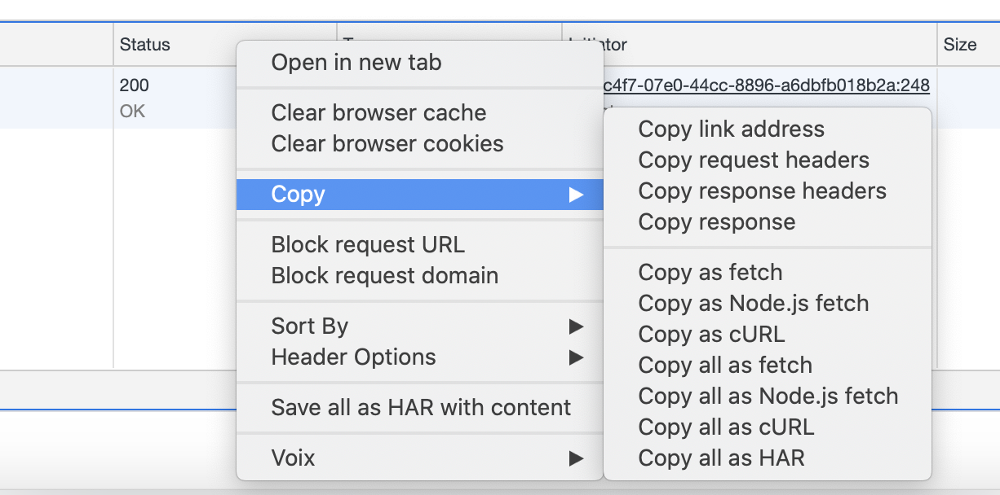

# BLACKFIRE.IO

> Blackfire helps developers profile, test, debug, and optimize performance of their applications.


References:

* Installing: https://blackfire.io/docs/up-and-running/installation
* Profiling in browser: https://blackfire.io/docs/cookbooks/profiling-http-via-browser

Table of content:

* [Blackfire signup & credentials](#register)
* [Installation](#install)
* [Chrome Extension & Profiling](#chrome-extension)

## <a name="register"></a> Blackfire signup & credentials

* https://blackfire.io/signup --> Login with your Google or Github account and complete your registration
* https://blackfire.io/docs/up-and-running/installation : when logged in, your credentials are available in the example CLI commands displayed:


```shell
sudo blackfire-agent --register --server-id=23f722f8-45e2-494e-XXXX-XXXXXXX --server-token=2cc54503db6e24407c6524XXXX... 
```

```shell
blackfire config --client-id=2a18b73f-e6dc-4f3c-XXXX-XXXXXXXXX --client-token=2eaeca5f6a956cdf636cc62eXXXX.... 
```

You can also access your credentials through your Blackfire account : https://blackfire.io/my/settings/credentials (Or menu Account/My Settings/Credentials)

## <a name="install"></a> Install Blackfire

Cf. https://blackfire.io/docs/up-and-running/installation

Check that Blackfire agent is running:

```shell
sudo service blackfire-agent status
```

## <a name="chrome-extension"></a> Chrome extension & Profiling

Download Chrome extension:

https://chrome.google.com/webstore/detail/blackfire-profiler/miefikpgahefdbcgoiicnmpbeeomffld

Profiling : https://blackfire.io/docs/cookbooks/profiling-http-via-browser

    💡 Each request you profile is available in your Blackfire Dashboard : https://blackfire.io/my/profiles (My profiles)

### Profiling Ajax requests

- Open the Chrome inspector
- Go to the "Network" tab
- Trigger your Ajax request
- In the Network tab, right click on your Ajax request and "copy as cURL" (see screenshot hereafter)
- Execute the following command : `blackfire curl <copied-cURL>`



## Timestamps

- Last update : July 2020
- Blackfire version (`blackfire version`) : 1.36.0
- Chrome extension (Profiler) version : 1.23.3