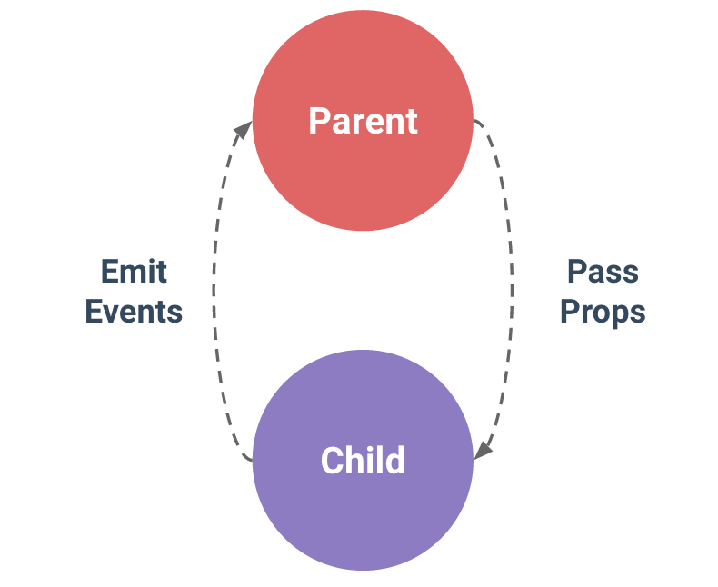

#Vue.js


* [Syntaxes des templates](#templates)
* [Classes CSS liées au modèle](#style)
* [Affichage des listes](#list)
* [Les composants](#components)
* [Ressources](#resources)
* [L'éco-système de Vue.js](#ecosystem)

##Références :

* Guide officiel : [https://vuejs.org/v2/guide/](https://vuejs.org/v2/guide/)
* Blog Elao : [Comment intégrer Vue.js dans une app Symfony](https://blog.elao.com/fr/dev/comment-integrer-vue-js-application-symfony/)

##<a name="templates"></a>Templates: syntaxe

Réf.: [https://vuejs.org/v2/guide/syntax.html](https://vuejs.org/v2/guide/syntax.html)

Syntaxe à la "Mustache":
```
  <span>Message: {{ msg }}</span>
```

__Nota__ : la syntaxe "Mustache" ne peut pas être utilisée dans les attributs HTML. Il faut utiliser la directive `v-bind`:

```
  <div v-bind:id="dynamicId"></div>
  <button v-bind:disabled="someDynamicCondition">Button</button>
```

Expressions JS sont utilisables, y compris dans les attributs HTML : 
```
{{ number + 1 }}
  {{ ok ? 'YES' : 'NO' }}
  {{ message.split('').reverse().join('') }}
  <div v-bind:id="'list-' + id"></div>
```

Directives : 
```
  <p v-if="seen">Now you see me</p>
  <a v-bind:href="url"></a>
  <a v-on:click="doSomething">
```

Modifieurs : `<form v-on:submit.prevent="onSubmit"></form>`

Filtres : 
```
  <!-- in mustaches -->
  {{ message | capitalize }}
  <!-- in v-bind -->
  <div v-bind:id="rawId | formatId"></div>
```
```
    new Vue({
      // ...
      filters: {
        capitalize: function (value) {
          if (!value) return ''
          value = value.toString()
          return value.charAt(0).toUpperCase() + value.slice(1)
        }
      }
    })
```

Raccourcis (`v-bind` et `v-on`) :
```
    <!-- full syntax -->
    <a v-bind:href="url"></a>
    <!-- shorthand -->
    <a :href="url"></a>
```
```
    <!-- full syntax -->
    <a v-on:click="doSomething"></a>
    <!-- shorthand -->
    <a @click="doSomething"></a>
```

##<a name="style"></a>Classes CSS et styles liés au modèle

Réf.: [https://vuejs.org/v2/guide/class-and-style.html](https://vuejs.org/v2/guide/class-and-style.html)

```
    <div class="static"
         v-bind:class="{ active: isActive, 'text-danger': hasError }">
    </div>
```

```
<div v-bind:class="[activeClass, errorClass]">
```
```
data: {
  activeClass: 'active',
  errorClass: 'text-danger'
}
```

`<div v-bind:class="[isActive ? activeClass : '', errorClass]">`

`<div v-bind:class="[{ active: isActive }, errorClass]">`

##<a name="list"></a>Affichage de listes

Réf.: [https://vuejs.org/v2/guide/list.html](https://vuejs.org/v2/guide/list.html)

* `<div v-for="item of items"></div>`
* `<div v-for="(value, key) in object">`
* `<div v-for="(value, key, index) in object">`

Noter que les composants ont leur propre scope privé. Il faut utiliser les `props` pour passer les données de l'itération aux composants :

```
    <my-component
      v-for="(item, index) in items"
      v-bind:item="item"
      v-bind:index="index">
    </my-component>
```

##<a name="components"></a>Les composants

Réf.: [https://vuejs.org/v2/guide/components.html](https://vuejs.org/v2/guide/components.html)

Dans une relation parent-enfant, les échanges se font `props down, events up` : 

* Le parent passe des données à ses enfants via les `props`
* Les enfants passent des informations à leur parent via des événements



```
    <!-- this passes down a plain string "1" -->
    <comp some-prop="1"></comp>
    <!-- this passes down an actual number -->
    <comp v-bind:some-prop="1"></comp>
```

Les enfants ne devraient pas modifier les données issues du parent. Toutefois, ce peut être utile dans deux cas d'utiliser des données du parent : 

* Pour utiliser une donnée du parent comme valeur initiale. Dans ce cas, on définit une donnée locale qui prend la valeur de la propriété du parent : 
``` 
    props: ['initialCounter'],
    data: function () {
      return { counter: this.initialCounter }
    }
```

* Une propriété (`prop`) est passée comme valeur brute et doit être transformée. Dans ce cas, utiliser `computed` :
```
    props: ['size'],
    computed: {
      normalizedSize: function () {
        return this.size.trim().toLowerCase()
      }
    }
```

__Nota__ : en Javascript, les tableaux et les objets sont passés par référence. Modifier une propriété (`prop`) de type tableau ou objet dans le composant enfant aura donc pour effet de modifier l'état du parent.

### Les événements ([https://vuejs.org/v2/guide/components.html#Using-v-on-with-Custom-Events](https://vuejs.org/v2/guide/components.html#Using-v-on-with-Custom-Events))

Chaque instance de Vue implémente une [interface d'events](https://vuejs.org/v2/api/#Instance-Methods-Events) et peut donc : 
* Ecouter un événement grâce à sa méthode `$on(eventName)`
* Lever un événement grâce à sa méthode `$emit(eventName)`

Exemple:

```
    <div id="counter-event-example">
      <p>{{ total }}</p>
      <button-counter v-on:increment="incrementTotal"></button-counter>
      <button-counter v-on:increment="incrementTotal"></button-counter>
    </div>
```
```
    Vue.component('button-counter', {
      template: '<button v-on:click="increment">{{ counter }}</button>',
      data: function () {
        return {
          counter: 0
        }
      },
      methods: {
        increment: function () {
          this.counter += 1
          this.$emit('increment')
        }
      },
    })

    new Vue({
      el: '#counter-event-example',
      data: {
        total: 0
      },
      methods: {
        incrementTotal: function () {
          this.total += 1
        }
      }
    })
```

##<a name="resources"></a>Ressources

* [Guide officiel de Vue.js](https://vuejs.org/v2/guide/)
* [Exemples (site officiel)](https://vuejs.org/v2/examples/)
* [Comment intégrer Vue.js dans une application Symfony (Blog Elao)](https://blog.elao.com/fr/dev/comment-integrer-vue-js-application-symfony/)
* [Applications Frontend avec Vue.js et vue-cli (Blog Elao)](https://blog.elao.com/fr/dev/realisez-une-application-vue-js-avec-vue-cli/)
* [Building a Vue.js app using vue-router (LiquidLight)](https://www.liquidlight.co.uk/blog/article/building-a-vue-v2-js-app-using-vue-router/)

##<a name="ecosystem"></a>L'éco-système de Vue.js

* [awesome-vue](https://github.com/vuejs/awesome-vue) : recense la plupart des ressources (tutoriels, plugins, librairies, etc.) autour de Vue.js
* [axios](https://github.com/mzabriskie/axios) : client Http Javascript
* [HackerNews clone with Vue.js](https://github.com/vuejs/vue-hackernews) : clone de HackerNews développé avec Vue.js (à titre de démo)
* [Nuxt.js](https://nuxtjs.org/) : framework Vue.js pour développer des applications Vue.js rendues par le serveur
* [vue-cli](https://github.com/vuejs/vue-cli) : outil CLI de génération de projets Vue (déclinaisons pour Webpack, Browserify, ou template simple)
* [vue-devtools](vue-devtools) : extension Chrome pour débuguer les appli. Vue.js
* [vue-loader](http://vue-loader.vuejs.org/en/) : loader Webpack pour transformer le code des composants Vue (*.vue) en modules JS
* [vue-resource](https://github.com/pagekit/vue-resource) : client Http pour Vue.js
* [vue-router](https://github.com/vuejs/vue-router) : router officiel de Vue.js
* [vuex](https://github.com/vuejs/vuex) : gestionnaire d'états centralisé (store partagé par tous les composants d'une application Vue.js)
